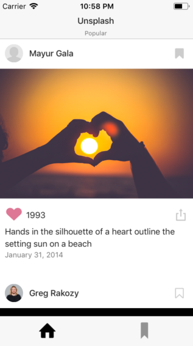
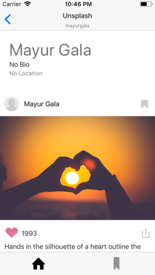
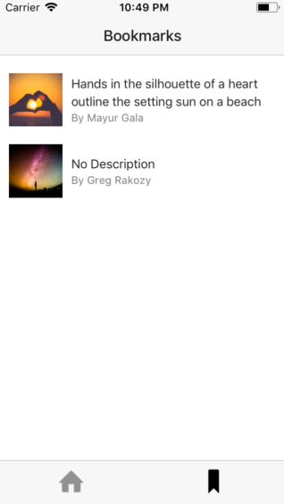
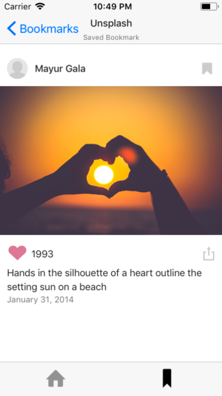
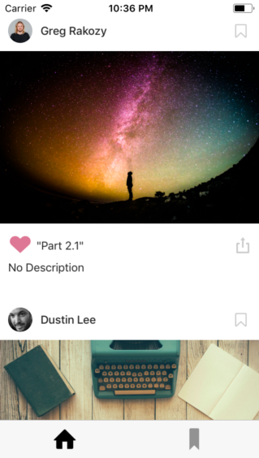
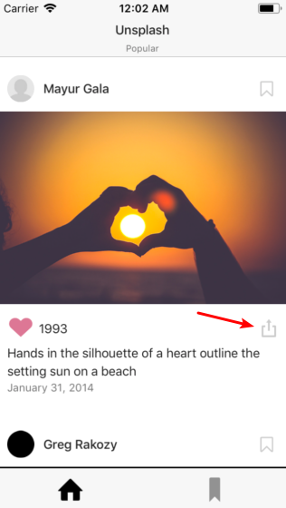
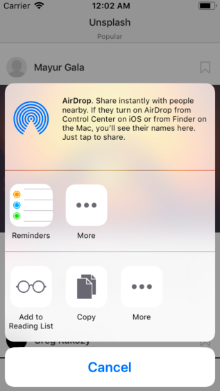
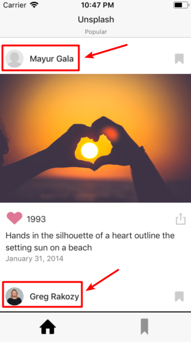
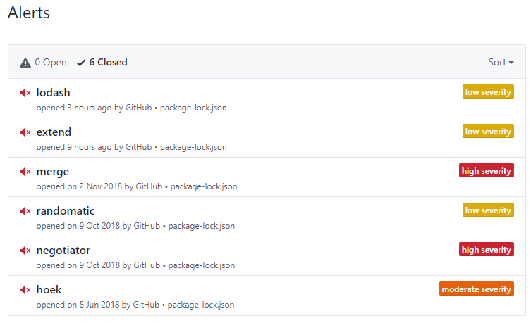

# Unsplash

[Alerts](#alerts)

## 各界面演示

### Home Screen



### User Profile Screen



### Bookmark Screen



### Bookmark Viewer Screen




## 步骤说明

### Part 1

第一部分进行的代码改动位于`App/Components/Components/Feed.js`下：

1. 首先，在`componentDidMount`部分中进行Feed Data的获取；

2. 完成`renderItem`函数，使其返回所定义的`FeedItem`组件并按需完成相关属性：

   ```jsx
   renderItem = ({item}) => {
     return (
       <FeedItem
         content={item}
         onProfilePressed={this.onProfilePressed}
       />
     );
   };
   ```

3. 增添所需要的属性，用于进行从`HomeScreen`到`UserProfileScreen`的切换，我将该函数命名为`profileRequestedCalledFunction`，如下：

   ```jsx
   static propTypes = {
     content: PropTypes.array,
     listHeaderComponent: PropTypes.object,
     profileRequestedCalledFunction: PropTypes.func,
   };
   ```

   如其名称所言，在`onProfilePressed`动作发生时需要进行该函数的调用：

   ```jsx
   onProfilePressed = username => {
     if (typeof this.props.profileRequestedCalledFunction === 'function') {
       this.props.profileRequestedCalledFunction(username);
     }
   };
   ```

4. 最后我们需要完成主界面，我们可以看出`render`函数中调用了`getTabContent`进行界面显示，则主界面的显示依赖于该函数的返回值部分，可以通过一个`FlatList`进行实现，如下所示：

   ```jsx
   getTabContent = () => {
     const {loading} = this.state;
     if (loading) {
       return (
         <ActivityIndicator/>
       );
     } else {
       return (
         <FlatList
           ListHeaderComponent={this.props.listHeaderComponent}
           data={this.state.feedEntries}
           renderItem={this.renderItem}
           keyExtractor={this._keyExtractor}
         />
       );
     }
   }
   ```

完成以上部分后，App的主界面显示如下：



### Part 2

接下来需要对`FeedItem`进行补充和实现，对`App/Components/Components/FeedItem.js`进行完成。

- 添加发布日期

  在`render`所返回的`View`最后增加一个用于显示日期的View即可，采用已经封装好的`getPostedDate`方法获取日期，如下：

  ```jsx
  <View style={styles.dateContainer}>
    <Text style={material.caption}>{this.getPostedDate()}</Text>
  </View>
  ```

  

- 增加分享操作

  只需要增加可点击的分享按钮即可，调用已封装好的`sharedPressed`函数唤起系统具体的分享操作，如下：

  ```jsx
  <TouchableOpacity onPress={this.sharedPressed}>
    <Entypo
      name="share-alternative"
      size={Metrics.icons.small}
      color={Colors.steel}/>
  </TouchableOpacity>
  ```

  

- 增加收藏操作

  首先更改`Text`标签内容如下：

  ```jsx
  <Text style={[material.body1, {flex: 1, marginLeft: 5}]}>{content.likes}</Text>
  ```

  随后，对于收藏内容，即bookmark的读取、保存、删除等操作进行实现：

  - 存储

    ```jsx
    _storeBookmark = async (bookmarks, newBookmarkItem) => {
      try {
        if (this._hasItem(bookmarks, newBookmarkItem)) {
          return;
        }
        const mutableBookmarks = [...bookmarks, newBookmarkItem];
        await AsyncStorage.setItem(AppConfig.keys.bookmarks, JSON.stringify(mutableBookmarks));
      } catch (error) {
        console.warn(error);
      }
    };
    ```

  - 读取

    ```jsx
    _getBookmarks = async () => {
      try {
        let bookmark = [];
        await AsyncStorage.getItem(AppConfig.keys.bookmarks, (error, result) => {
          if (error) {
            console.warn(error);
          } else {
            if (result) {
              bookmark = JSON.parse(result);
            }
          }
        });
        return bookmark;
      } catch (error) {
        console.warn(error);
      }
      return [];
    };
    ```

  - 删除

    ```jsx
    _removeBookmark = async (bookmarks, newItem) => {
      const mutableBookmarks = bookmarks;
      for (let index = 0; index < mutableBookmarks.length; index++) {
        if (mutableBookmarks[index].id === newItem.id) {
          mutableBookmarks.splice(index, 1);
          break;
        }
      }
      try {
        await AsyncStorage.setItem(AppConfig.keys.bookmarks, JSON.stringify(mutableBookmarks));
      } catch (error) {
        console.warn(error);
      }
    };
    ```

### Part 3

需要完成`HomeScreen`和`UserProfileScreen`、`BookmarkScreen`和`BookmarkViewerScreen`之间的导航，其定义位于`App/Components/Navigation/AppNavigation.js`文件中，对涉及到的`StackNavigator`对象完成如下：

```jsx
const stackNavWithHomeScreen = StackNavigator({
  HomeScreen: {screen: HomeScreen},
  UserProfileScreen: {screen: UserProfileScreen},
}, {
  initialRouteName: 'HomeScreen',
  headerMode: 'float',
});
const stackNavWithBookmarkScreen = StackNavigator({
  BookmarkScreen: {screen: BookmarkScreen},
  BookmarkViewerScreen: {screen: BookmarkViewerScreen},
}, {
  initialRouteName: 'BookmarkScreen',
  headerMode: 'float',
});
```

随后对总的`TabNav`进行修改，如下：

```jsx
const TabNav = TabNavigator({
  FeedScreen: {screen: stackNavWithHomeScreen},
  BookmarkScreen: {screen: stackNavWithBookmarkScreen},
}, {
  // Default config for all screens
  initialRouteName: 'FeedScreen',
  tabBarOptions: {
    activeTintColor: Colors.black,
    showLabel: false,
  },
});
```

### Part 4

在上一步`AppNavigation`的实现下更进一步：

在`App/Screens/HomeScreen.js`中进行navigate：

```jsx
onProfileRequested = username => {
  console.log("Requested: " + username);
  this.props.navigation.navigate('UserProfileScreen', {username: username});
};
render() {
  return (
    <View style={styles.container}>
      <Feed profileRequestedCalledFunction={this.onProfileRequested}/>
    </View>
  );
}
```

通过以上操作，在主界面对用户信息进行点击时便可以进入用户详细信息界面查看，如下图：



### Part 5

在`App/Screens/BookmarkScreen.js`中进行navigate：

```jsx
bookmarkPressed = (item) => {
  this.props.navigation.navigate('BookmarkViewerScreen', {content: item});
};
```

还需要对`getBookmarks`方法进行实现，用于进行收藏bookmark内容的获取，获取方式与Part 2中的基本相同：

```jsx
getBookmarks = async () => {
  try {
    let bookmark = [];
    await AsyncStorage.getItem(AppConfig.keys.bookmarks, (error, result) => {
      if (error) {
        console.warn(error);
      } else {
        if (result) {
          bookmark = JSON.parse(result);
        }
      }
    });
    return bookmark;
  } catch (error) {
    console.warn(error);
  }
  return [];
};
```

在主界面进行收藏之后我们可以在`BookmarkScreen`看到收藏内容，点击收藏内容便可进入`BookmarkViewerScreen`，如下图所示，在左图进行点击便可以进入右图：


## Alerts

This project is not maintained since it was finished. Please note.

